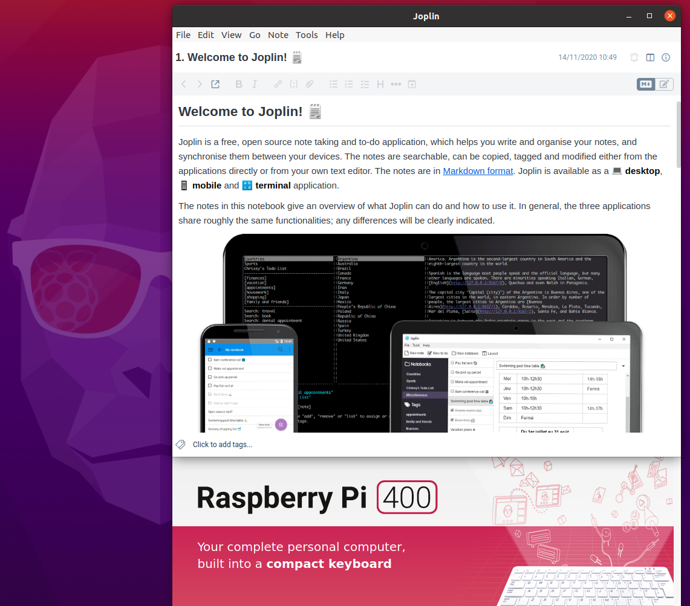

## Helper script to build joplin for arm64 systems

The `build.sh` script contains the modified steps required to download and build
the latest version of the [joplin](https://github.com/laurent22/joplin)
software on ARM64 architectures, such as the Raspberry Pi.

The main difference with the official build procedure is the removal of the
keytar module dependency. This module is not available for the target
architecture, see [related discussion](https://github.com/laurent22/joplin/issues/3711).

This has been tested on Ubuntu 20.10 running on a Raspberry Pi 400.

**There is no explicit management of dependencies**, you will need to install
all the tools required to build joplin, such as gcc, node, npm, python, etc.

The script will place all temporary results in a subdirectory of `/tmp` and, upon
success, package the Cli and Electron clients in a `dist` directory next to the
source script.

The code is provided as-is, free to use and modify.
